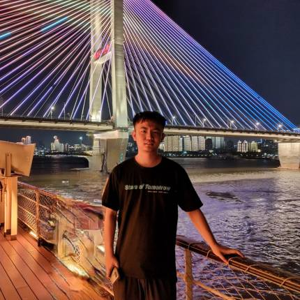

Hi, I am a Ph.D. student in the Computer Science Department at the University of Rochester. My advisor is Prof. Chenliang Xu. Before joining Prof. Xu's lab, I got my bachelor degree of Computer Science at Huazhong University of Science and Technology (HUST). 

My research interests lie in Deep Learning and High Performance GPU Computing for AI, especially adversarial learning, tensor learning and gradient optimization.

