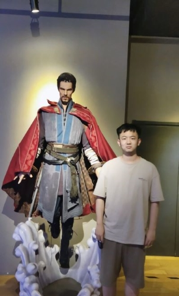

## Me

## Who am I (Work)
Hi, I am Zeliang Zhang,  a Ph.D. student in the Computer Science Department at the University of Rochester. My advisor is Prof. Chenliang Xu. Before joining Prof. Xu's lab, I got my bachelor degree of Computer Science at Huazhong University of Science and Technology (HUST). I spent a really wonderful 4 years here and got to know abut AI with the help of Prof. Kun He.  I had ever worked as an research intern for almost 8 monthts in Machine Learning Sustainability (MLSS) group of Microsoft Research Asia, Beijing. My research mentor was Xinran Wei and my job was to fully utilize the GPU power to accelerate the computation of DFT, which is important to many areas, especially  material and chemistry science. Besides, I had ever worked as an intern in Guanghua Management School of Peking Universivity and did some research about model robusntess and training methods with the guidance of Prof. Yijie Peng.

My research interests lie in Deep Learning and High Performance GPU Computing for AI, especially adversarial learning, tensor learning and gradient optimization.

## Who am I (Life)
I come from Zibo, a medium size city of Shandong Province in China. I like watching movies, playing volleyballs and hanging out. I love trips without any plans with my friends. I love climbing and skiing. I am a little 'complex'. Sometimes I really like to talking with friends while sometimes I just want to stay alone and watch the water flow. I am willing to face challenges while I am a little fear about the uncentainty of the future. I love the feeling staying with my friends and family while I want to step out the comfortable zone to see the outside world. I have many big dreams while I am really lazy:( Anyway, I am still trying to get better!

## Research and Publibcations

1. __Zeliang Zhang__, X.Y. Liu, Pan Zhou. Trillion-Tensor: Trillion-Scale CP Tensor Decomposition, IJCAI 2020 Tensor
Network Representations in Machine Learning Workshop.  
2. __Zeliang Zhang__, Junzhe Zhang, Guoping Lin, Zeyuan Yin, Kun He. Parallel TTr1-Tensor:Randomized Compression-based Scheme for
Tensor Train Rank-1 Decomposition, NeurIPS 2020 Quantum Tensor Networks in Machine Learning Workshop.  
3. __Zeliang Zhang__, Yipeng Wang, Zeqi Liu, Xiao-Yang Liu. DHN: Deep Hamiltonian Network for Variational Reinforcement Learning, NeurIPS 2021 Quantum Tensor Networks in Machine Learning Workshop.  
4. Li Xiao, __Zeliang Zhang__, Jinyang Jiang, Yijie Peng, Noise Optimization in Artificial Neural Networks, CASE 2022.  
5. Xiaosen Wang, __Zeliang Zhang__, Kangheng Tong, Dihong Gong, Kun He, Zhifeng Li, Wei Liu, Triangle Attack: A Query-efficient Decision-based Adversarial Attack, ECCV 2022.  
7. __Zeliang Zhang__, Jinyang Jiang, Zhaofei Yu, Yijie Peng, Noise-injection training for Better Model Robustness, submitted to NeurIPS 2022.
8. Edward Small, Wei Shao, Yufan Kang, __Zeliang Zhang__, Jeffrey Chan, Kacper Sokol, Flora Salim, Robustness of Fairness Optimisation Strategies, submitted to ICDE 2023.  

